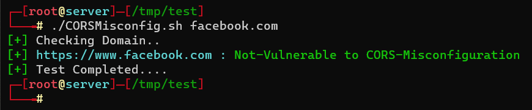
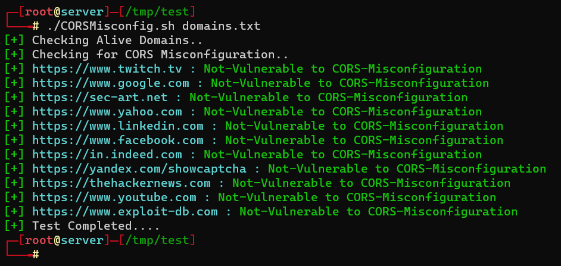

## CORSMisconfig

Shell script to check for CORS (Cross Origin Resource Sharing) misconfigurations on web applications. To Read more details about CORS Miconfiguration read my blog post at here [__sec-art.net/cors-misconfig__]()  

## Installation 

__Dependency__ : [httpx](https://github.com/projectdiscovery/httpx), [rush](https://github.com/shenwei356/rush)    

__Install__ : Clone repository and run the script. 

```
chmod +x CORSMiconfig.sh
./CORSMisconfig.sh google.com
```  

## Usage :  

```  
./CORSMisconfig.sh

Usage: ./CORSMisconfig.sh [Domains_List_File|Domain_Name]

Example Usage :

        ./CORSMisconfig.sh SubDomains.txt
        ./CORSMisconfig.sh domain.com

Result : Stored on 'CORSMisconfig.txt'
```  

### Using against single domain 

```
./CORSMisconfig.sh facebook.com  
```  

  

### Using against multiple domains 

```  
./CORSMisconfig.sh domains.txt   
```  

where domains.txt contains domain names. 

    
